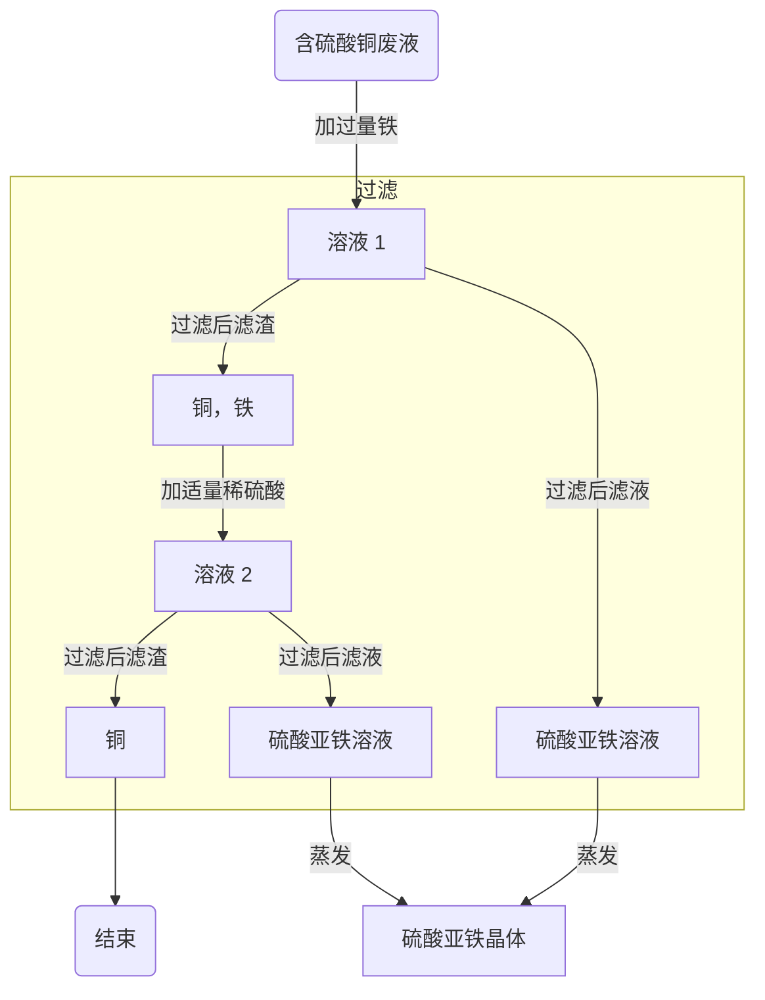

# 第五章 金属的冶炼与利用

$$\S 5.1 \ 金属的性质$$

一. 物理性质

（一）颜色

1. 块状银白色，有金属光泽。粉末状黑色。
2. 有一些特例，例如：$\ce{Au}$ 金黄色，$\ce{Cu}$ 紫红色或亮红色。

（二）硬度小。

（三）密度

1. 密度小于 $4.5\ g/cm^3$：轻金属，如：$\ce{Mg,Al}$。
2. 密度大于 $4.5\ g/cm^3$：重金属，如：$\ce{Hg,Pb,Ba,Cd,Cu}$。

（四）熔沸点

1. 熔点最低：$\ce{Hg}$。
2. 熔点最高：$\ce{W}$。

（五）金属特性

1. 导电性：$\ce{Ag > Cu > Al}$，$\ce{Cu}$ 用作电线，电缆。$\ce{Al}$ 用作高压线。除金属外还有石墨具有导电性。
2. 导热性：$\ce{Ag}$，用作暖瓶瓶胆。
3. 延展性。

二. 化学性质

（一）与 $\ce{O2}$ 反应

1. 镁在空气中燃烧：$\ce{2Mg + O2 \xlongequal{点燃} 2MgO}$。
2. $\ce{Fe}$ 在 $\ce{O2}$ 中燃烧：$\ce{3F3 + 2O2 \xlongequal{点燃} Fe3O4}$。
3. $\ce{Cu}$ 与 $\ce{O2}$ 反应
    - 原理：$\ce{2Cu + O2 \xlongequal{\Delta} 2CuO}$。
    - 现象：固体从紫红色变成黑色。
    - 用途：除去混合气中的 $\ce{O2}$。
4. $\ce{Al}$ 和 $\ce{O2}$ 反应
    - 原理：$\ce{4Al + 3O2 \xlongequal{} 2Al2O3}$。
    - 一层致密氧化膜。
    - 现象：铝表面变暗。
    - 应用：暖气片刷“银粉”即铝粉。
5. 真金不怕火炼：金的化学性质稳定。

（二）与酸反应

1. 分别将 $\ce{Mg,Zn,Fe,Cu}$ 加入稀硫酸中。
2. 实验室制 $\ce{H2}$
    - 原理：$\ce{Zn + H2SO4 \xlongequal{} ZnSO4 + H2 ^}$。
    - 置换反应：$单质 + 化合物 \xrightarrow{} 化合物 + 单质$。
    - $\ce{Zn + 2HCl \xlongequal{} ZnCl2 + H2 ^}$。
    - $\ce{Mg + H2SO4 \xlongequal{} MgSO4 + H2 ^}$。
    - $\ce{Mg + 2HCl \xlongequal{} MgCl2 + H2 ^}$。
    - $\ce{2Al + 3H2SO4 \xlongequal{} Al2(SO4)3 + 3H2 ^}$。
    - $\ce{2Al + 6HCl \xlongequal{} 2AlCl3 + 3H2 ^}$。
    - $\ce{Fe + H2SO4 \xlongequal{} FeSO4 + H2 ^}$。
    - $\ce{Fe + 2HCl \xlongequal{} FeCl2 + H2 ^}$。
    - 现象：固体消失，产生气泡。镁：放大量热。铁：溶液从无色变成绿色。
    - 反应后溶液质量一定增加。
    - 常见金属活动性顺序：$\ce{K,Ca,Na},\boxed{\ce{Mg,Al,Zn,Fe}},\ce{Sn,Pb,(H),Cu,Hg,Ag Pt,Au}$，其中 $\ce{H}$ 指酸中的阳离子（氢离子）。
    - 置换时活动性强的置换活动性差的。
    - 相同条件下，常考 $4$ 种金属生成 $\ce{H2}$ 快慢：$\ce{Mg > Al > Zn > Fe}$。
    - 生成 $\ce{H2}$ 多少：$m=\dfrac{m_金 \times 化合价}{相对原子质量}$，等质量 $4$ 种金属生成 $\ce{H2}$ 质量：$\ce{Al > Mg > Fe > Zn}$。
    - 等质量 $\ce{Mg,Al}$ 分别于等质量、同浓度稀硫酸反应：

（三）与盐溶液反应

1. 盐：$\ce{CuSO4,CaCO3,KNO3}$ 等。
    - 在硫酸铜溶液中放入一个铁片。
    - 原理（湿法炼铜的原理）：$\ce{Fe + CuSO4 \xlongequal{} Cu + FeSO4}$。
    - 现象：铁表面析出红色固体，溶液从蓝色变成浅绿色。
    - 反应条件：前置后（金属活动性表中前面的置换后面的），盐比溶。
2. 其它金属和盐溶液的反应
    - $\ce{Fe + 2AgNO3 \xlongequal{} 2Ag + Fe(NO3)2}$。
    - $\ce{Fe + Cu(NO3)2 \xlongequal{} Cu + Fe(NO3)2}$。
    - $\ce{Cu + 2AgNO3 \xlongequal{} 2Ag + Cu(NO3)2}$。
3. 反应生成物
    - 一定量 $\ce{Fe}$ 放在 $\ce{AgNO3}$ 和 $\ce{Cu(NO3)2}$ 混合液中充分反应后过滤。
    - | 滤渣 | 滤液 |
      |:-----|----:|
      | $\ce{Ag}$ | 可能有 $\ce{Ag+}$，一定有 $\ce{Cu^2+,Fe^2+}$ |
      | $\ce{Ag,Cu}$ | 可能有 $\ce{Cu^2+}$，一定有 $\ce{Fe^2+}$ |
      | $\ce{Ag,Cu,Fe}$ | 一定有 $\ce{Fe^2+}$ |
    - 鉴别方法：除 $\ce{Fe}$ 用稀盐酸，除 $\ce{Cu}$ 用铜丝自沉。
    - 
    - 反应后溶液质量不一定变大。
4. 补充
    - 检验或除去某金属，一般用酸。
    - 比较金属活泼性，如 $\ce{Mg,Fe,Cu}$。使用 $\ce{Mg,Fe,Cu,HCl(aq)}$（不好）或 $\ce{Mg,FeSO4,Cu}$ 或 $\ce{MgSO4,Fe,CuSO4}$。
5. 金属回收（铜）

三. 合金

（一）金属材料：纯金属，合金。

（二）合金

1. 定义：一种金属跟其它金属或非金属溶合而成的有金属特性的物质。
2. 合金性质
    - 至少含 $1$ 种金属。
    - 各元素均以单质形式存在。
    - 优良性能：硬度大，熔点低，耐腐蚀性高。
3. 铁的合金
    - 生铁：$\ce{C}$ 含量：$2\ \% - 4.3\ \%$，硬度大。
    - 钢：$\ce{C}$ 含量：$0.03\ \% - 2\ \%$，韧性好。
